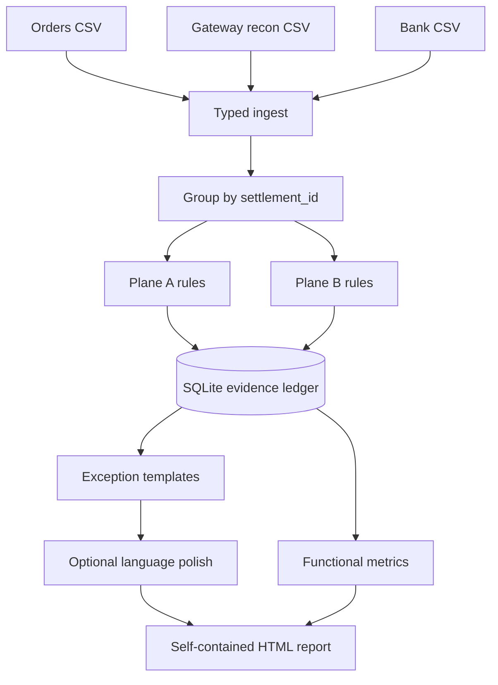

# Milaan — AI Finance Controller

[](#verification)
[](pyproject.toml)

Milaan closes one finance-operations loop across a reproducible 1,200-order
synthetic benchmark: merchant orders → gateway settlement-recon rows → bank
credits. It reports the matches it can prove and an evidence-rich exception for
everything it cannot.

> **The books are code. The model only explains them.**

The matching engine contains zero model calls. A language model may polish an
exception narrative and investigation checklist, but a field firewall prevents
its output from changing an identifier, amount, reason code, match, exception,
or functional metric. CI compares `functional_metrics.json` byte-for-byte with
the language layer on and off.

## Design law

**If acceptance of evidence is decidable by bounded enumeration, the capability
belongs to deterministic code.**

Three adversarial design reviews removed three false reasons to place a model
near money: greedy subset solving, LLM tie adjudication, and allow-listed fuzzy
UTR recovery. Milaan now uses direct settlement grouping, mutual uniqueness,
bounded deterministic recovery, database exclusivity, and explicit abstention.

## Architecture



- **Plane A:** PAYMENT transaction ↔ merchant order using order reference,
  payment reference, then mutually unique amount/date evidence.
- **Plane B:** `settlement_id` batch ↔ bank credit using exact UTR, mutually
  unique amount/date evidence, then bounded FULL/SUFFIX/one-confusable recovery.
- **Database firewall:** a plane-scoped `UNIQUE` constraint prevents an entity
  being consumed twice; `NOT NULL`, composite foreign keys, and
  `PRAGMA foreign_keys=ON` make that guarantee executable.
- **Unsafe batch firewall:** one unsupported recon member taints the entire
  batch. Milaan abstains instead of silently calculating a partial sum.

## Run it

Requirements: Python 3.11+, Git, and Make.

```bash
python -m venv .venv
source .venv/bin/activate
python -m pip install -e '.[dev]'
make demo
```

Open `data/run42/report.html`. The demo requires no API key and makes no network
call.

Useful commands:

```bash
make test                 # all unit, adversarial, and end-to-end tests
make ci                   # clean + three mixed seeds + full second demo cycle
make demo-live            # optional prose polish; templates stand without config
milaan gen --records 1200 --seed 42 --profile mixed --out data/run42
milaan run --data data/run42 --db data/run42/milaan.db --llm mock
milaan eval --run data/run42 --db data/run42/milaan.db --out-dir data/run42 --gate mixed
milaan report --run data/run42 --db data/run42/milaan.db --out data/run42/report.html
```

Live polish uses `MILAAN_LLM_MODEL`, `MILAAN_LLM_API_KEY`, and
`MILAAN_LLM_BASE_URL`. Responses are cached outside the recreated run database
at `data/.llm_cache.sqlite` (override with `MILAAN_CACHE_PATH`). Never commit a
real key.

## Verification

Named benchmark: **seed 42 · mixed profile · generator 1.2.1 · 1,200 orders**.

| Functional result | Numerator / denominator | Result |
|---|---:|---:|
| Plane A correct auto-matches | 1,154 / 1,154 | 100.00% |
| Plane B correct auto-matches | 21 / 21 | 100.00% |
| Expected exception recall | 6 / 6 | 100.00% |
| Exception precision | 6 / 6 | 100.00% |
| Entity completeness | 2,363 / 2,363 | 100.00% |
| False matches | 0 / 1,175 found matches | 0 |

These numbers are generated by `make demo` and recorded with input hashes in
`functional_metrics.json` and `docs/BUILD_LOG.md`. The precise claim is **zero
false matches on this named synthetic benchmark**—not a universal claim about
real payment data. Runtime and model-cost telemetry live in a separate file and
are never golden-tested.

## Evidence and failure behavior

Every accepted match stores the rule, candidate identifiers, amount delta,
business-day gap, confidence metadata, and database members. Every abstention
stores all relevant candidates, a stable reason code, a canonical action, and
optional polished prose. The report includes:

- signed member nets whose sum proves a batch amount;
- the matching bank credit and delta;
- exact character offsets for a deterministic B2 recovery;
- two settlements processed on one date, proving grouping is by
  `settlement_id`, not date;
- functional metrics visually separated from runtime telemetry.

## Known failures and deliberate limits

- The benchmark is synthetic and internally consistent; it is not evidence of
  production accuracy on an unseen bank export.
- No FX, real bank API, money movement, authentication, or posting workflow is
  included.
- Unknown recon member types taint and abstain the whole batch. Milaan does not
  guess their accounting effect.
- Combined-credit residue becomes `AMBIGUOUS_COMBINED`. CP-SAT is explicitly
  not approved or shipped.
- UTR recovery accepts only full identifiers, unique suffixes of at least six
  characters, and one fixed confusable substitution. Anything else abstains.
- Live prose quality depends on the configured provider. Canonical templates
  remain the authoritative fallback.

## Repository guide

- `milaan/generator/` — deterministic world, disjoint injections, manifest
- `milaan/ingest/` — explicit string parsing, quarantine, taint, aggregation
- `milaan/engine/` — Plane A, Plane B, bounded recovery, pipeline
- `milaan/exceptions/` — stable codes, precedence, canonical actions
- `milaan/llm/` — language-only client, cache, and invariance filter
- `milaan/evalx/` — the only code allowed to read ground truth
- `milaan/report/` — self-contained printable HTML report
- `tests/` — unit, adversarial, property, golden, and end-to-end gates

See `docs/ARCHITECTURE.md`, `docs/DECISIONS.md`, and `docs/BUILD_LOG.md` for the
review trail and exact engineering decisions.
