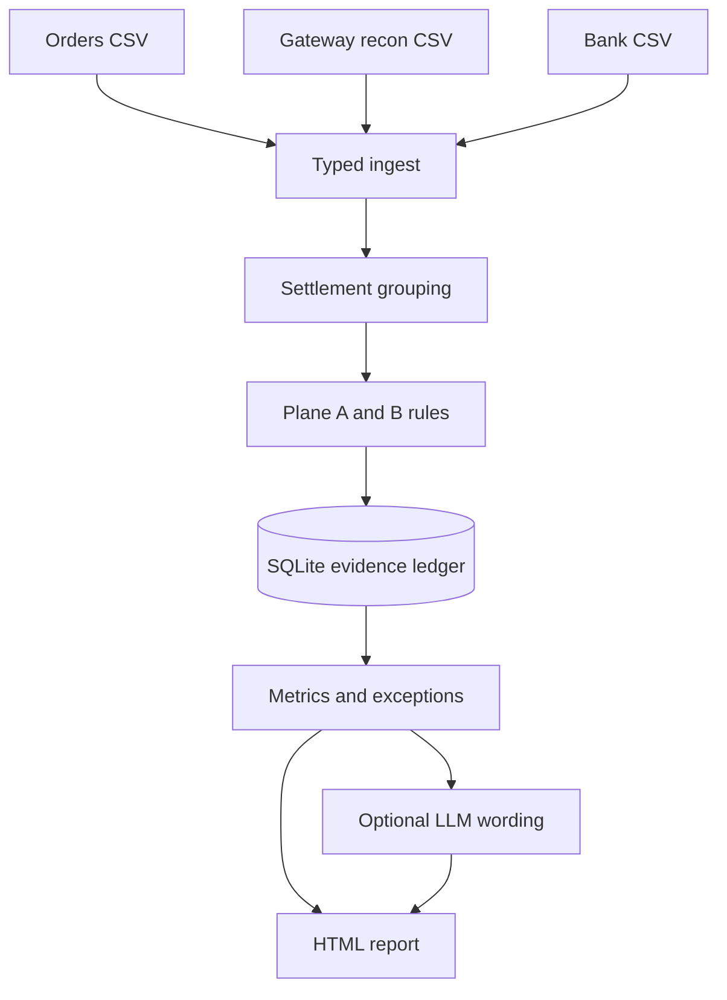

# Milaan — AI Finance Controller

[](#verify-the-build)
[](pyproject.toml)
[](#quick-start-no-api-key)

Milaan is a deterministic three-way settlement controller for **Track 04: AI
Finance Controller**. It closes one finance-operations loop across merchant
orders, gateway settlement-reconciliation rows, and bank credits. It proves the
matches it can defend, reports measured accuracy, and produces an evidence-rich
exception for every item it cannot resolve.

The included named benchmark contains **1,200 synthetic orders**, well above the
track's 50-record minimum. The complete demo runs locally without an API key.

> **The books are code. The model only explains them.**

## Why this fits Track 04

| Track requirement | What Milaan submits |
|---|---|
| Close one finance-ops loop | Order → gateway transaction → settlement batch → bank credit |
| 50+ synthetic records | Reproducible 1,200-order benchmark with disjoint difficulty injections |
| Report match rate | Plane A and Plane B numerators, denominators, and exact rates |
| Report unresolved exceptions | Stable reason codes, candidates, evidence, and next action |
| Throughput plus measured accuracy | One-command run, golden metrics, runtime telemetry, and CI gates |
| Honest exception list | Ambiguity and unsupported rows cause abstention, never a guessed match |

Milaan follows the example direction **multi-source reconciliation**. It does not
claim to be a general ledger, cash forecaster, tax engine, or production payment
system.

## What happens in one run



- **Plane A** matches each payment transaction to a merchant order using order
  reference, payment reference, then mutually unique amount/date evidence.
- **Plane B** matches each `settlement_id` batch to a bank credit using exact
  UTR, mutually unique amount/date evidence, then bounded deterministic
  FULL/SUFFIX/one-confusable recovery.
- **Database exclusivity** prevents any entity from being consumed twice.
- **Taint-and-abstain** blocks a whole batch when it contains an unsupported
  member; partial sums are never silently accepted.
- **The optional LLM** may rewrite only the human-language narrative and
  guidance. It cannot create a match or change an identifier, amount, exception
  code, or metric. Unsafe output is rejected and the canonical template remains.

## Quick start: no API key

Requirements: Python 3.11 or newer. Git and Make are convenient but not required
when using the downloaded ZIP.

### macOS or Linux

```bash
python3 -m venv .venv
source .venv/bin/activate
python -m pip install -e '.[dev]'
make demo
```

If `make` is unavailable, run the four commands in the [manual workflow](#manual-workflow).

### Windows PowerShell

```powershell
py -3.11 -m venv .venv
.\.venv\Scripts\Activate.ps1
python -m pip install -e ".[dev]"
python -m milaan.cli gen --records 1200 --seed 42 --profile mixed --out data/run42
python -m milaan.cli run --data data/run42 --db data/run42/milaan.db --llm mock
python -m milaan.cli eval --run data/run42 --db data/run42/milaan.db --out-dir data/run42 --gate mixed
python -m milaan.cli report --run data/run42 --db data/run42/milaan.db --out data/run42/report.html
```

Open `data/run42/report.html` in a browser. It is self-contained and makes no
network request. A verified prebuilt example is also included at
`data/samples/run42/report.html`.

Useful ways to open it:

```bash
open data/run42/report.html       # macOS
xdg-open data/run42/report.html  # Linux
```

```powershell
start data\run42\report.html     # Windows
```

## Manual workflow

```bash
python -m milaan.cli gen --records 1200 --seed 42 --profile mixed --out data/run42
python -m milaan.cli run --data data/run42 --db data/run42/milaan.db --llm mock
python -m milaan.cli eval --run data/run42 --db data/run42/milaan.db --out-dir data/run42 --gate mixed
python -m milaan.cli report --run data/run42 --db data/run42/milaan.db --out data/run42/report.html
```

The stages are deliberately separate:

1. `gen` writes deterministic source files and private benchmark truth.
2. `run` reconciles the three sources without reading that truth.
3. `eval` compares results with truth and applies the named benchmark gate.
4. `report` renders a printable, self-contained HTML report.

Use `--llm mock` for the canonical offline templates. This is the default,
recommended judging path.

## Bring your own LLM (optional)

Another user can connect their own key and model for exception-language polish.
Milaan supports the three major HTTP contract families and a local shortcut:

| `MILAAN_LLM_PROVIDER` | API contract | API key | Base URL |
|---|---|---|---|
| `openai-compatible` | `/chat/completions` | Optional for local servers; normally required by hosted services | Required |
| `ollama` | Ollama's OpenAI-compatible endpoint | Not required | Defaults to `http://localhost:11434/v1` |
| `anthropic` | Native Anthropic Messages API | Required | Defaults to `https://api.anthropic.com/v1` |
| `gemini` | Native Gemini `generateContent` API | Required | Defaults to `https://generativelanguage.googleapis.com/v1beta` |

Aliases `openai`, `claude`, and `google` are accepted. “OpenAI-compatible” means
any hosted or local model server that implements the Chat Completions request and
response shape. A provider with a different proprietary API needs a small new
adapter in `milaan/llm/live.py`; no project can truthfully support every unknown
API shape automatically.

### 1. Create a private configuration

```bash
cp .env.example .env
```

On Windows PowerShell:

```powershell
Copy-Item .env.example .env
```

Milaan automatically reads `.env` from the repository root in live mode.
Existing shell environment variables take precedence. To keep the file
elsewhere, set `MILAAN_ENV_FILE` to its path. `.env` is gitignored—never put a
real API key in the README, source code, demo video, or submission ZIP.

### 2. Choose one provider configuration

OpenAI-compatible hosted or self-hosted endpoint:

```dotenv
MILAAN_LLM_PROVIDER=openai-compatible
MILAAN_LLM_MODEL=<provider-model-name>
MILAAN_LLM_API_KEY=<your-key-if-required>
MILAAN_LLM_BASE_URL=https://your-provider.example/v1
```

Anthropic:

```dotenv
MILAAN_LLM_PROVIDER=anthropic
MILAAN_LLM_MODEL=<anthropic-model-name>
MILAAN_LLM_API_KEY=<your-anthropic-key>
MILAAN_LLM_BASE_URL=
```

Google Gemini:

```dotenv
MILAAN_LLM_PROVIDER=gemini
MILAAN_LLM_MODEL=<gemini-model-name>
MILAAN_LLM_API_KEY=<your-gemini-key>
MILAAN_LLM_BASE_URL=
```

Local Ollama (start Ollama and install the model first):

```dotenv
MILAAN_LLM_PROVIDER=ollama
MILAAN_LLM_MODEL=<installed-ollama-model>
MILAAN_LLM_API_KEY=
MILAAN_LLM_BASE_URL=
```

### 3. Run with live wording

```bash
make demo-live
```

Or without Make:

```bash
python -m milaan.cli gen --records 1200 --seed 42 --profile mixed --out data/run42
python -m milaan.cli run --data data/run42 --db data/run42/milaan.db --llm live
python -m milaan.cli eval --run data/run42 --db data/run42/milaan.db --out-dir data/run42 --gate mixed
python -m milaan.cli report --run data/run42 --db data/run42/milaan.db --out data/run42/report.html
```

Provider responses are cached in `data/.llm_cache.sqlite`, separate from the
recreated run database. Set `MILAAN_CACHE_PATH` to move it. Delete only this
cache file if you want to force new language calls.

### Live-mode settings

| Variable | Default | Meaning |
|---|---|---|
| `MILAAN_LLM_PROVIDER` | `openai-compatible` | Provider contract or supported alias |
| `MILAAN_LLM_MODEL` | none | Provider-specific model identifier |
| `MILAAN_LLM_API_KEY` | none | User's own key; never stored in the run DB |
| `MILAAN_LLM_BASE_URL` | provider default or none | Override API root; required for generic OpenAI-compatible servers |
| `MILAAN_LLM_JSON_MODE` | `native` | Use `prompt` if a compatible server rejects native JSON mode |
| `MILAAN_LLM_MAX_TOKENS` | `600` | Maximum generated tokens per exception |
| `MILAAN_LLM_TIMEOUT_SECONDS` | `30` | HTTP timeout per call |
| `MILAAN_LLM_PRICE_IN_PAISE_PER_1K` | `0` | Optional input-token price for local telemetry |
| `MILAAN_LLM_PRICE_OUT_PAISE_PER_1K` | `0` | Optional output-token price for local telemetry |
| `MILAAN_CACHE_PATH` | `data/.llm_cache.sqlite` | Persistent response cache |
| `MILAAN_ENV_FILE` | repository `.env` | Optional path to a different environment file |

If configuration, authentication, networking, JSON parsing, or the content
firewall fails, Milaan records an audit event and uses its canonical prose. The
reconciliation run still completes. Functional results must remain
byte-identical between `--llm mock` and `--llm live`.

Official API references: [OpenAI-compatible behavior in
Ollama](https://docs.ollama.com/api/openai-compatibility), [Anthropic Messages
API](https://docs.anthropic.com/en/api/messages), and [Gemini
generateContent](https://ai.google.dev/api/generate-content).

## Inputs and outputs

The synthetic generator writes:

| File | Purpose |
|---|---|
| `orders.csv` | Merchant orders and payment references |
| `gateway_recon.csv` | Payment/refund/adjustment rows, settlement IDs, UTRs, fees, and taxes |
| `bank.csv` | Credits, dates, narration, and bank references |
| `run_meta.json` | Seed, profile, record count, and generator version |
| `manifest.json` | Synthetic ground truth used only by `eval`, never by the engine |

The pipeline adds:

| File | Purpose |
|---|---|
| `milaan.db` | Evidence ledger, matches, members, exceptions, audit events, and LLM telemetry |
| `functional_metrics.json` | Deterministic scored results with real denominators and input hashes |
| `runtime_telemetry.json` | Wall-clock and stage timing; never treated as a functional metric |
| `report.html` | Self-contained reviewer-facing report |

The current submission is benchmark software with an exact CSV contract. It
does not directly ingest arbitrary bank or gateway exports. A real deployment
would add source-specific adapters that map exports into these schemas, then
validate on a separately labelled dataset. The synthetic `manifest.json` and
benchmark accuracy claims do not apply to production data.

## Verification

Named benchmark: **seed 42 · mixed profile · generator 1.2.1 · 1,200 orders**.

| Functional result | Numerator / denominator | Result |
|---|---:|---:|
| Plane A correct auto-matches | 1,154 / 1,154 | 100.00% |
| Plane B correct auto-matches | 21 / 21 | 100.00% |
| Expected exception recall | 6 / 6 | 100.00% |
| Exception precision | 6 / 6 | 100.00% |
| Entity completeness | 2,363 / 2,363 | 100.00% |
| False matches | 0 / 1,175 found matches | 0 |

These numbers are reproduced by `make demo` and recorded with input hashes in
`functional_metrics.json` and `docs/BUILD_LOG.md`. The precise claim is **zero
false matches on this named synthetic benchmark**—not universal zero false
matches on real payment data.

## Verify the build

```bash
make test   # unit, adversarial, provider-contract, golden, and end-to-end tests
make ci     # tests + clean gate + three mixed seeds + full second demo cycle
```

Without Make:

```bash
python -m unittest discover -s tests -v
```

The provider tests use local fake responses and make no paid API calls. A real
key is intentionally not included. The CI invariant test verifies that enabling
the language layer cannot alter `functional_metrics.json`.

## Evidence and failure behavior

Every accepted match stores its rule, candidates, amount delta, business-day
gap, confidence metadata, and database members. Every abstention stores the
relevant candidates, a stable reason code, canonical action, and optional
polished prose. The report demonstrates:

- signed transaction nets whose sum proves a settlement batch amount;
- the matching bank credit and amount delta;
- exact character offsets for deterministic fuzzy UTR recovery;
- multiple settlements sharing a date while remaining separate batches;
- functional metrics visibly separated from runtime telemetry;
- ambiguity that causes a deliberate abstention.

## Troubleshooting

| Symptom | Fix |
|---|---|
| `python` or `py` cannot be found | Install Python 3.11+ and reopen the terminal |
| PowerShell blocks activation | Run the four commands with `.venv\Scripts\python.exe` instead of activating |
| `make` cannot be found | Use the manual four-command workflow |
| Live mode says model or base URL is required | Check `.env`, provider spelling, and the provider examples above |
| Provider returns HTTP 401/403 | Use a valid user-owned key with access to the selected model |
| Provider returns HTTP 404 | Use the API root, not a dashboard URL; check `MILAAN_LLM_BASE_URL` |
| Compatible server rejects `response_format` | Set `MILAAN_LLM_JSON_MODE=prompt` |
| Ollama connection fails | Start Ollama, install the named model, and confirm port 11434 is reachable |
| Live prose does not change | Inspect audit events; the provider may be unavailable or its output failed the safety firewall |
| Browser shows raw files instead of the app | Open `report.html`; Milaan is a CLI plus generated report, not a hosted web server |

## Deliberate limits

- The benchmark is synthetic and internally consistent; it is not evidence of
  production accuracy on an unseen bank export.
- No FX, real bank API, authentication, money movement, or posting workflow is
  included.
- Unknown recon member types taint and abstain the entire batch.
- Combined-credit residue becomes `AMBIGUOUS_COMBINED`; CP-SAT is not approved
  or shipped.
- UTR recovery accepts only full identifiers, unique suffixes of at least six
  characters, and one fixed confusable substitution.
- LLM support is language-only and provider-contract based; it does not make
  proprietary API shapes interchangeable.

## Repository guide

- `milaan/generator/` — deterministic world, disjoint injections, manifest
- `milaan/ingest/` — explicit parsing, quarantine, taint, aggregation
- `milaan/engine/` — Plane A, Plane B, bounded recovery, pipeline
- `milaan/exceptions/` — stable codes, precedence, canonical actions
- `milaan/llm/` — provider adapters, language-only client, cache, firewall
- `milaan/evalx/` — the only code allowed to read synthetic ground truth
- `milaan/report/` — self-contained printable HTML report
- `tests/` — unit, adversarial, contract, golden, and end-to-end gates
- `docs/` — architecture, decisions, build log, review trail, submission guide

Start with `docs/SUBMISSION_GUIDE.md` for the five-minute reviewer walkthrough.
See `docs/ARCHITECTURE.md`, `docs/DECISIONS.md`, and `docs/BUILD_LOG.md` for the
engineering evidence.
