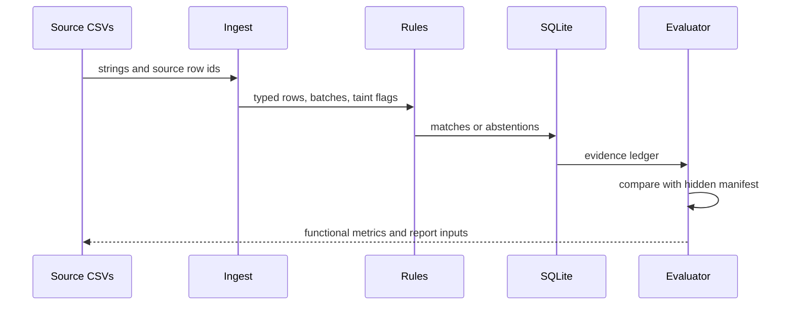

# Architecture

## Objective

Milaan reconciles merchant orders, gateway settlement-recon rows, and bank
credits without allowing probabilistic output to alter accounting state.

## Trust boundaries

1. `generator/` creates deterministic source files and a hidden evaluation
   manifest. The matching engine cannot import or read that manifest.
2. `ingest/` converts strings explicitly, validates fee arithmetic, quarantines
   malformed rows, and taints any batch containing an unsupported member.
3. `engine/` creates candidate edges and accepts only exact or mutually unique
   deterministic evidence. B2 bounded recovery is ordinary code.
4. SQLite owns consumption exclusivity. A match and all of its members are one
   transaction; any uniqueness or foreign-key failure aborts the decision.
5. `exceptions/` assigns reason codes and canonical actions before language
   polishing.
6. `llm/` may write only `narrative` and `guidance`. A content filter rejects
   newly invented identifiers or monetary amounts. Functional metrics exclude
   both fields and are byte-compared across modes.
7. `evalx/` alone reads ground truth and emits deterministic functional metrics.
   Runtime and LLM telemetry are kept separate.

## Processing sequence

## Determinism

- Money is signed integer paise.
- Generation uses one explicit `random.Random(seed)` instance.
- Dates use a fixed synthetic holiday calendar.
- CSV order, columns, newlines, JSON key order, and functional metric formatting
  are stable.
- Wall-clock data appears only in run metadata, audit, and telemetry.

## Failure containment

- Conflicting identifiers, duplicate source lines, non-unique candidates, and
  unsupported batch members terminate as exceptions.
- Unknown combined credits are reported as `AMBIGUOUS_COMBINED`; no solver is
  shipped.
- A failed language call leaves canonical templates unchanged.
