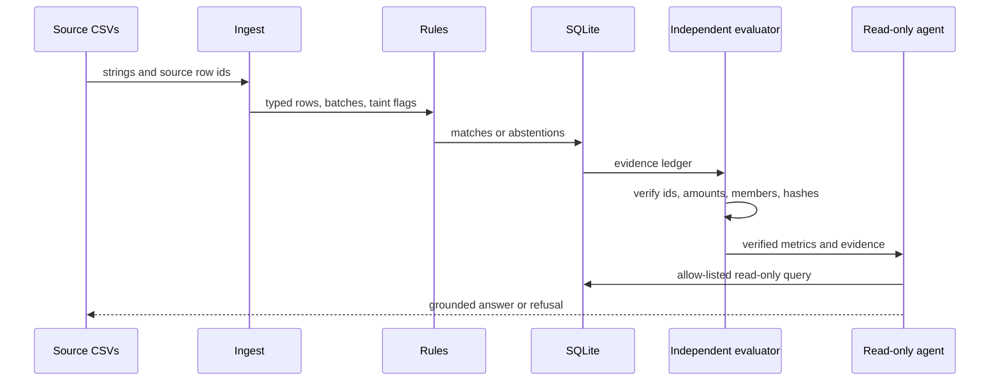

# Architecture

## Objective

Milaan reconciles merchant orders, gateway settlement-recon rows, and bank
credits without allowing probabilistic output to alter accounting state.

## Trust boundaries

1. `generator/` creates deterministic source files and a ground-truth manifest.
   The matching engine cannot import or read that manifest; it reads
   `run_meta.json` for seed and profile and nothing else.
2. `ingest/` converts strings explicitly, validates fee arithmetic, quarantines
   malformed or duplicate rows, and taints any batch containing any rejected member.
3. `engine/` creates candidate edges and accepts only exact or mutually unique
   deterministic evidence. Amount equality is exact on every tier. B2 bounded
   recovery is ordinary code.
4. SQLite owns consumption exclusivity. A whole plane is one transaction, and
   `UNIQUE(run_id, plane, entity_type, entity_id)` physically rejects any entity
   being consumed twice.
5. `exceptions/` assigns reason codes, control-specific narratives, and canonical
   actions before any optional provider call.
6. `agent/` exposes ten read-only finance tools. A write or override request is
   refused at an authority boundary that runs *before* any model is consulted. A
   model may then select one tool and typed arguments, but deterministic code
   produces every fact and evidence id. Unknown tools, extra fields, invalid
   argument names or types, and unusable model bodies are refused or fall back.
7. `evalx/` never reads the answer key beside the data it scores. It rebuilds
   truth from the run's immutable generation inputs and binds four things before
   scoring: evaluated CSV files byte-identical to canonical, every stored
   database row identical to its canonical row, the shipped manifest identical to
   reconstruction, and mandatory monetary facts present for every expected match.
   A failed gate publishes no metrics file at all.
8. `view.py` is the single presentation source. `report/` and `dashboard.py`
   render it and compute no financial value; neither can mutate accounting state.

## The evaluator trust anchor

```
run_meta.json          the only trusted input
  seed, profile, records, generator_version, config_hashes
        │
        ▼
  deterministic regeneration into a temporary directory
        │
        ├── canonical CSV files  ──► must equal the evaluated CSV files
        ├── canonical row set    ──► must equal every stored database row
        ├── canonical manifest   ──► must equal the shipped manifest
        └── canonical truth      ──► the answer key actually used for scoring
```

Nothing in the run directory is trusted as truth. The shipped `manifest.json` is
*checked*, and a difference is reported rather than tolerated. `match_facts` is
mandatory: there is no path in which a missing fact downgrades scoring to an
identifier-only comparison.

## Processing sequence



## Determinism

- Money is signed integer paise.
- Generation uses one explicit `random.Random(seed)` instance.
- Dates use a fixed synthetic holiday calendar.
- CSV order, columns, newlines, JSON key order, and functional metric formatting
  are stable.
- Wall-clock data appears only in run metadata, audit, and telemetry.
- A generated manifest contains SHA-256 values of the exact source CSV files.
  Those hashes are a convenience, not the trust anchor: evaluation compares the
  evaluated files against files it regenerated itself, so recomputing the
  manifest hashes after tampering does not help an attacker.
- Regeneration is byte-identical for the same (records, seed, profile) and takes
  about 0.3 seconds at 10,000 orders.

## Failure containment

- Conflicting identifiers, duplicate source lines, reversed chronology,
  non-unique candidates, and rejected batch members terminate as exceptions.
- Every physical source row reaches one terminal bucket: matched, exception,
  quarantine, or named ignored state.
- Unknown combined credits are reported as `AMBIGUOUS_COMBINED`; no solver is
  shipped.
- A failed or invalid model selection falls back to deterministic routing or a
  refusal. Model output never becomes a financial answer.
