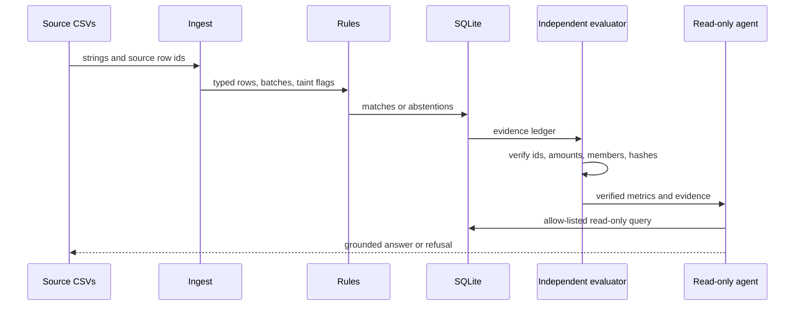

# Architecture

## Objective

Milaan reconciles merchant orders, gateway settlement-recon rows, and bank
credits without allowing probabilistic output to alter accounting state.

## Trust boundaries

1. `generator/` creates deterministic source files and a hidden evaluation
   manifest. The matching engine cannot import or read that manifest.
2. `ingest/` converts strings explicitly, validates fee arithmetic, quarantines
   malformed or duplicate rows, and taints any batch containing any rejected member.
3. `engine/` creates candidate edges and accepts only exact or mutually unique
   deterministic evidence. B2 bounded recovery is ordinary code.
4. SQLite owns consumption exclusivity. A match and all of its members are one
   transaction; any uniqueness or foreign-key failure aborts the decision.
5. `exceptions/` assigns reason codes, immutable status language, and canonical
   actions before any optional provider call.
6. `agent/` exposes seven read-only finance tools. A model may select one tool
   and typed arguments, but deterministic code produces every fact and evidence ID.
   Unknown tools, extra fields, invalid arguments, and write requests are refused.
7. `evalx/` alone reads ground truth. It checks pairs, monetary facts, settlement
   member sets, input hashes, one-to-one exceptions, source-record conservation,
   amount conservation, and separate workload coverage.
8. `report/` and `dashboard.py` are presentation surfaces. Neither can mutate
   matches or accounting state.

## Processing sequence

## Determinism

- Money is signed integer paise.
- Generation uses one explicit `random.Random(seed)` instance.
- Dates use a fixed synthetic holiday calendar.
- CSV order, columns, newlines, JSON key order, and functional metric formatting
  are stable.
- Wall-clock data appears only in run metadata, audit, and telemetry.
- A generated manifest contains SHA-256 values of the exact source CSV files;
  evaluation fails if truth is reused with modified inputs.

## Failure containment

- Conflicting identifiers, duplicate source lines, reversed chronology,
  non-unique candidates, and rejected batch members terminate as exceptions.
- Every physical source row reaches one terminal bucket: matched, exception,
  quarantine, or named ignored state.
- Unknown combined credits are reported as `AMBIGUOUS_COMBINED`; no solver is
  shipped.
- A failed or invalid model selection falls back to deterministic routing or a
  refusal. Model output never becomes a financial answer.
